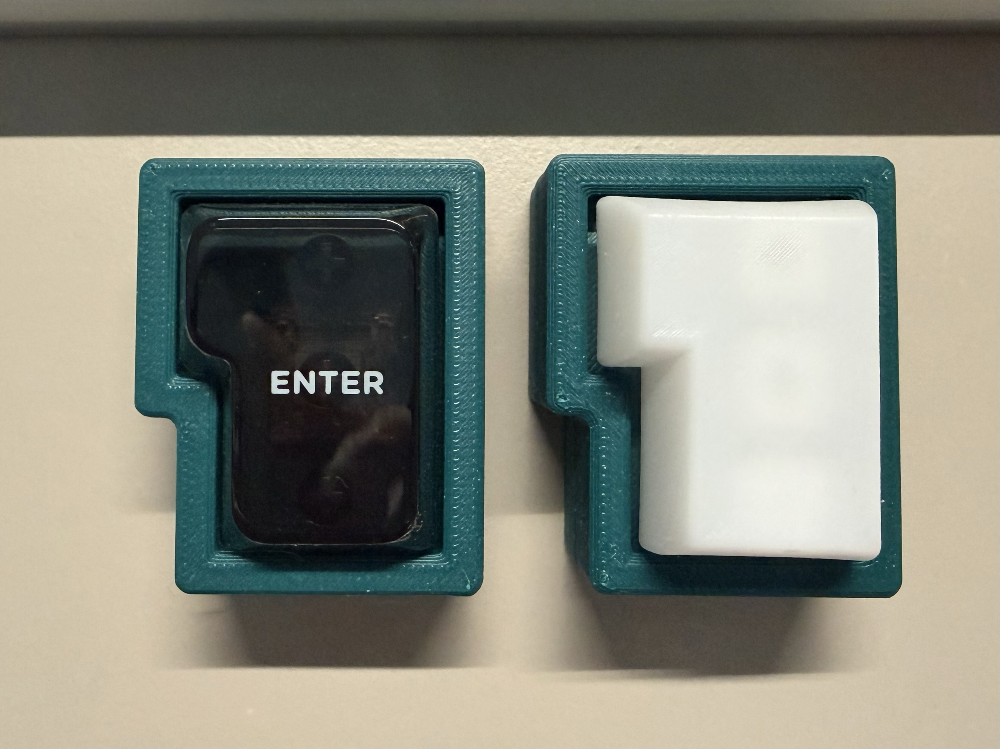
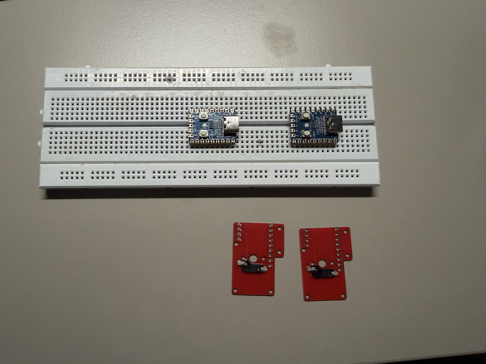
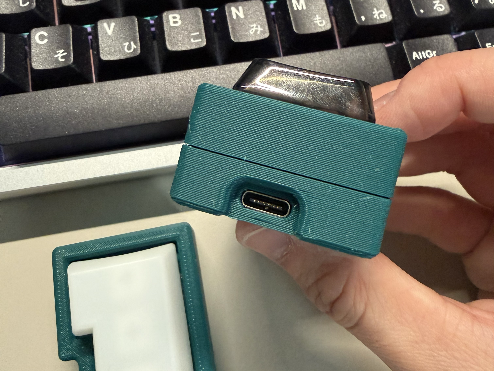
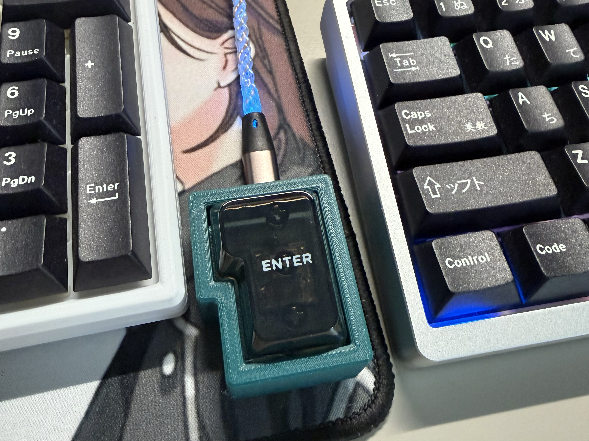

See original isopad [here](https://github.com/keyboard-magpie/isopad)

Changes made from the original isopad.

| from | to |
|--- | --- |
|pro micro footprint | rp2040 zero footprint | 
| LED | LED removed |
| solder MX | hotswap MX |
| pcb stabs | stabless | 

1.2 mm pcb

 

## pics
| | |
| --- | --- |
|  | |
|  |  |

 

## materials
| | |
| --- | --- |
| 1 | pcb |
| 1 | rp2040 zero |
| 1 | MX HS socket (CPG151101S11) |
| 1 | MX switch | 
| 1 | ISO enter keycap | 
| 1 | case (top and bottom) | 
| 8 | M2x5mm heatset inserts | 
| 4 | M2x3mm screws |
| 4 | M2x8mm screws |

 

## pending
- make qmk/vial firmware available on top of current morse code
- add bootmagic 

- add option for top case with plate stabs compatability
- think about case weight
